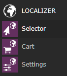
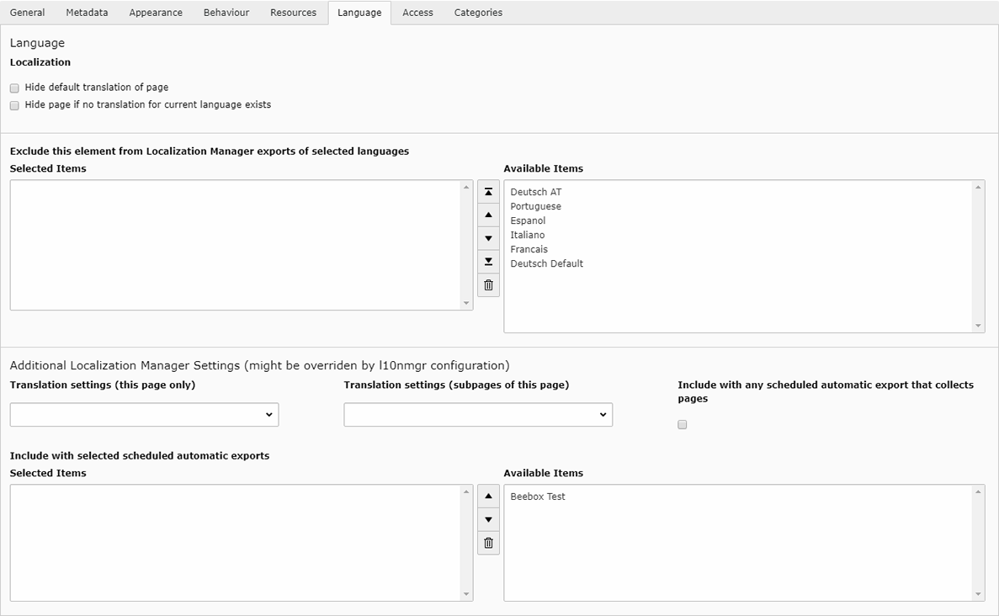
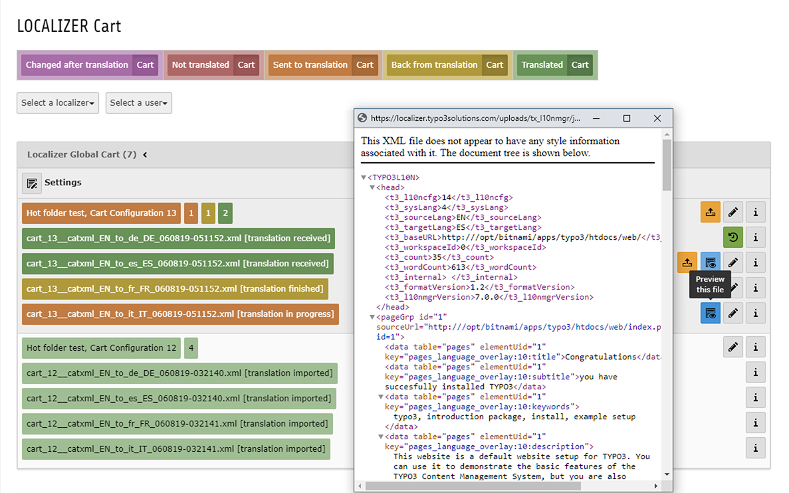

.. include:: ../Includes.txt

.. _for-editors:

===========
For Editors
===========

.. _LocalizerSelector:

Localizer Selector
==================

To create a new translation task with the Localizer go to the section LOCALIZER in your module menu and click on the Selector

.. _figure0:

   Localizer Modules

After the selector module has opened, you have to select a page from the page tree, since each translation process needs at least one page record to be working on.

#. Select one of the available Localizers for your translation tasks. If there is only one, you can proceed to the next step without selecting one.
#. Select one of the available Carts for your translation tasks. If you did not create one yet, you can create a new cart now.
#. Select one or more of the available Languages of that Localizer. Each selected language will at least create a translated page later on. So leave those languages unchecked, that should not be translated at all.
#. Select one or more of the translatable tables of the page you are working on.
#. If you have a large number of records on that page you can define a time frame to reduce the amount of records within the selector to the ones that have been created or changed within that time frame.
#. Click on "Store" and you should see a matrix similar to the :ref:`figure1`

.. tip::
    Each of the colors described in the legend will be used to mark the status of the records within the matrix. Additionally there are tool tips for people with colour vision impairment.

.. _figure1:
.. figure:: ../Images/Screenshots/Selector.png
   :class: with-shadow
   :alt: Localizer Selector
   :width: 300px

   Localizer Selector

By clicking on the matrix fields or the buttons within the matrix you can select and/or deselect single records within a single language, whole languages or single records within all languages and even groups of records and their children. Just follow the tool tips to get the different options.
If you are done with your selection, click on "Finalize" to close the cart and push it into the translation process.

.. important::
    You can put records from several different pages into a single cart, but make sure to click on "Store" before you proceed to another page. Otherwise your selection will be lost.
    Before you click on "Finalize" make sure that you are really done with that cart, since it can not be reopened later on.

.. _AutomaticExport:

Automatic Export
================

Each Localizer Cart can be configured to work with automatic exports of pages. If this is activated, you can put a page into the automatic workflow of a specific localizer configuration or you can activate a checkbox to have it appear in each automatic export regardless of the localizer configuration.

.. tip::
    Make sure that your administrator configured the necessary actions in the localizer configurations and activated the automatic export task in the scheduler, if you want to make use of automatic exports.

.. _figure4:

   Localizer Cart

.. _LocalizerCart:

Localizer Cart
==============

Each Localizer Cart consists of several files, one per translation task and target language. Each of the files can have a different translation status, which is indicated by the colors visible in the legend and a small info text like ``[translation in progress]``.

.. tip::
    The status of each file gets changed automatically via scheduler tasks, so you will get an overview of the current status of each cart. By clicking on the numbered buttons to the right of a cart you can filter the list of files so that it only shows the selected status.

.. _figure3:

   Localizer Cart

.. _LocalizerCartMarkForImport:

Mark files for the importer
"""""""""""""""""""""""""""

There is only one step within the whole workflow that needs some manual intervention: As soon as the translation has been received, you have to mark the translated files that you want to be imported during the next scheduler call.
You can preview their files by clicking on the blue preview button. If you click twice, you will get the original file and the translated file for a side bas side comparison.

These files are marked with the yellow upload button and you can either click on just one of them or on the whole cart to schedule each of the files for import. Scheduled files are indicated with the green clock icon.

.. tip::
    To avoid performance problems during the import, only a single file will be imported during each scheduler run, so it needs a little patience until each of them has been imported.