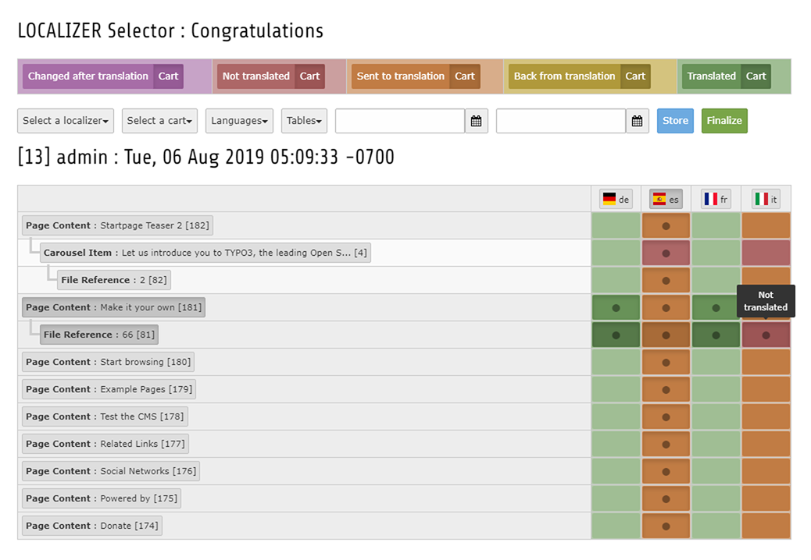
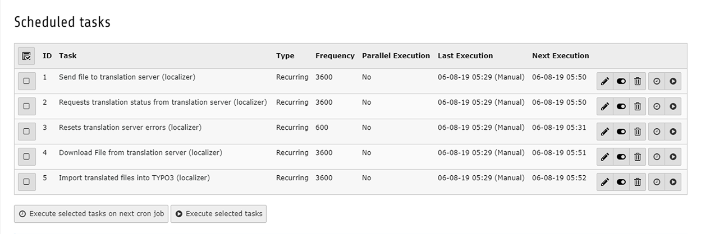
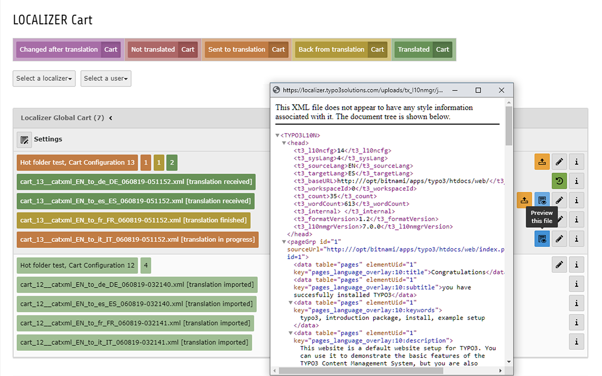

.. include:: ../Includes.txt

.. _introduction:

============
Introduction
============

.. _what-it-does:

What does it do?
================

This extension provides a fully automated workflow and a graphical user interface for the well known `Localization Manager (l10nmgr) <https://extensions.typo3.org/extension/l10nmgr/>`__.

While the L10nmgr still provides exports and imports of records and files, the Localizer will take care of all the necessary steps in between.
Editors responsible for translations won't have to deal with any L10nmgr configurations anymore and as an administrator you create just one configuration per Localizer Project.

- Create tasks, select and store items from several pages with the :ref:`figure1` until you finalize them into a cart for that particular task.
- Configure pages for specific localizer projects and vice versa to create a fully automatic workflow without having to manually select items at all.
- Now several :ref:`figure2` provide the automatic workflow from sending files, requesting translations status and resetting errors to downloading and importing translated files.
- Get an overview of current translation tasks with the :ref:`figure3`, check their status and preview their translated XML files before you schedule them for the import.

While the basic Localizer extension provides you with a simple configurable hot folder to exchange files with translation service providers, enhancing your Localizer projects with the Beebox API plugins will connect your TYPO3 directly to Wordbee's Beebox.
That way you can add a fully automated Beebox translation process to your TYPO3 project, while still giving your editors a unified interface and workflow.

If you haven't got a Beebox account yet, make sure to contact the people at Wordbee, who will happily provide you with the necessary details.

.. _wordbeelogo:

Wordbee S.A., 11 boulevard du Jazz, L-4370 Belvaux

`Wordbee TYPO3 translation connectors <https://www.wordbee.com/translation-connectors/typo3-translation-localization/>`__

.. _screenshots:

Screenshots
===========

.. _figure1:

   Localizer Selector

.. _figure2:

   Scheduler Tasks

.. _figure3:

   Localizer Cart